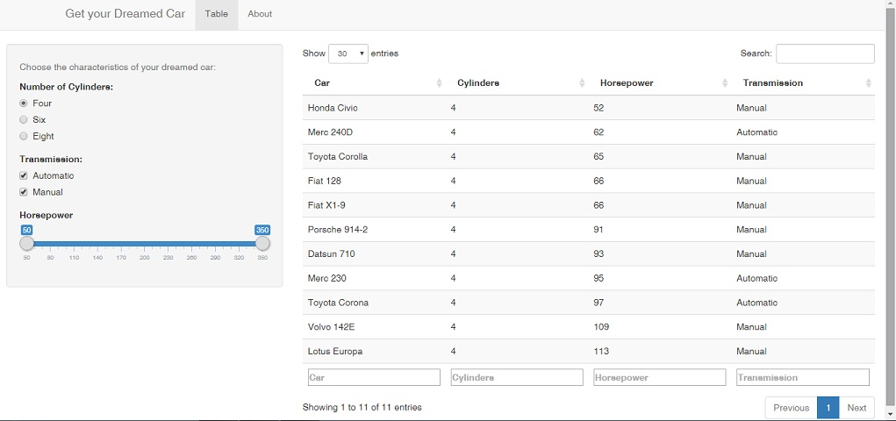

## *Get your Dreamed* Car Application

The app was developed to help you choose your dreamed car using the mtcars dataset from R. The selection of cars are based on the car's characteristics as inputs.

The app will do the filtering based on the car's characteristics that you have chosen i.e. *the number of Cylinders*, *the gross Horsepower* and *the Transmission type*. 

The table result will show only the cars that match your **chosen characteristics**. You can sort the table of result according to the variable that you want by clicking the arrows at the top of the respective column in the table.

To see the application itself check [here](https://irzan3.shinyapps.io/nazri/)


## An Overview of *mtcars* Data Set

```{r}

str(mtcars)
head(mtcars, 4)

```


## Chosen Characteristics

There are about 9 car characteristics that we can play around but I only choose the 3 popular characteristics which are as the followings

- Number of Cylinders - cyl
- Gross Horsepower - hp
- Transmission Type - am

Of course we can create our own data set with the latest car models to replace the mtcars data set provided it has a similar data structure as mtcars data set. 

## A screenshot of the Output



